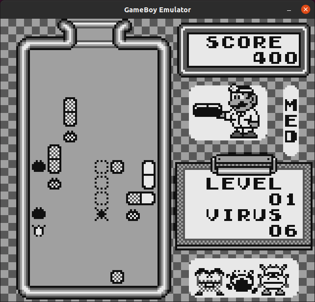

# c-gameboy

A Nintendo GameBoy emulator implemented in C





## Running

    ~/c-gameboy-build/emulator $PATH_TO_ROM_FILE
    ~/c-gameboy-build/emulator --help


## Development

    apt install git build-essential cmake libsdl2-dev

    git clone git@github.com:zaccrites/c-gameboy.git
    cmake -S c-gameboy -B ~/c-gameboy-build
    make -C ~/c-gameboy-build


### Debugging Tips

Use the `m` key to dump each memory section to a file.
For ease of inspection on the command line, these commands are useful:

```sh

# For OAM: bytes are Y, X, pattern number, and flags
xxd -g1 -c4 -o 0xfe00 oam.bin | nl -w2 -s'  '

```


## License

This project is released under the [MIT License](https://opensource.org/licenses/MIT)
